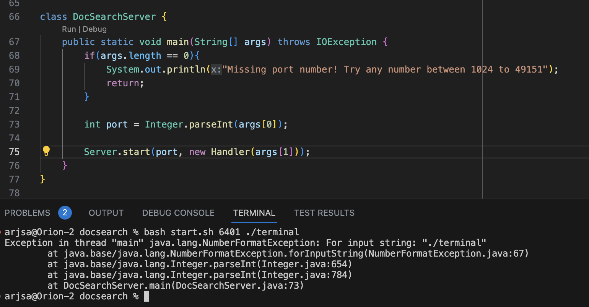

# Lab Report 5
Name: Arjun Sarup

PID: A17527244

Email: asarup@ucsd.edu

---

## Sample Student Problem

Hi, I've been having a problem with the docsearch lab. Every time I try to start a server using `bash start.sh [PORT] [FILE PATH]`, I get an exception.


**What environment are you using (computer, operating system, web browser, terminal/editor, and so on)?**

I'm working on a Mac and using the terminal in VSCode to run the program.

**Detail the symptom you're seeing. Be specific; include both what you're seeing and what you expected to see instead. Screenshots are great, copy-pasted terminal output is also great. Avoid saying “it doesn't work”.**

Here's a screenshot of my terminal output.



**Detail the failure-inducing input and context. That might mean any or all of the command you're running, a test case, command-line arguments, working directory, even the last few commands you ran. Do your best to provide as much context as you can.**

I ran the server using the bash script `start.sh`, which uses `javac` to compile `DocSearchServer.java` and `Server.java`, then runs `DocSearchServer` with the `java` command. For some reason, it seems like the `DocSearchServer` file is setting `args[0]` to `./technical` instead of the port number and then trying to parse that, resulting in a `NumberFormatException`. Is there some issue with how I'm indexing into args?


## Potential TA Response
It seems like the problem might not be the `DocSearchServer` file, but your `start.sh` bash script. Are you passing the command-line arguments to `DocSearchServer` in the correct order?


## Student Resolution
Seems like that was the issue. I was passing `$2` before `$1` in my `java` command, which mixed up `args[0]` and `args[1]`. Once I fixed it it ran just fine. 

Thanks for the help!


## Bug Details

Nothing about the file structure or anything was out of the ordinary; all of the `.java` files were in the working directory (`docsearch`), and `./technical` was a valid subdirectory within the working directory to pass as an argument. Before the bug was fixed, the problematic `start.sh` script had the following contents:
```
set -e

javac Server.java DocSearchServer.java
java DocSearchServer $2 $1
```
While `DocSearchServer` used the command line arguments in this order:
```
        int port = Integer.parseInt(args[0]);

        Server.start(port, new Handler(args[1]));
```
Although the student ran `start.sh [PORT] [FILE PATH]` (which is the intended ordering of the command line inputs as seen from `DocSearchServer`), the bash script swapped the order of these arguments, resulting in an error when `Integer.parseInt()` was run on a non-nunmeric String, `./technical`. The fixed code was simply changing `start.sh` to this:
```
set -e

javac Server.java DocSearchServer.java
java DocSearchServer $1 $2
```
Which preserves the order of the command line inputs as they are passed to the bash script.


## Reflection
Personally, the most interesting thing I learned in this second half of the quarter was how to use `vim`. Although the commands are a bit weird and counterintuitive, I'm glad I finally learned how I can edit text files from the terminal. Not to mention that in the fall next year, I'm going to have to write entire programming assignments in `vim`, so I'm grateful that I've gotten the hang of the basics early on. Besides that, the most useful things I've learned this quarter is probably about using `git` commands from the terminal. I recently joined a club called Triton Neurotech at the start of the quarter, and we use GitHub extensively to keep track of all our work, and at first I was so lost and a bit helpless when it came to pulling/accessing and pushing files to and from our GitHub page. Now though, I know enough to manage on my own (at least until some really weird stuff starts happening). Ultimately, the past few weeks have taught me some useful skills that I see myself using heavily in the future.
